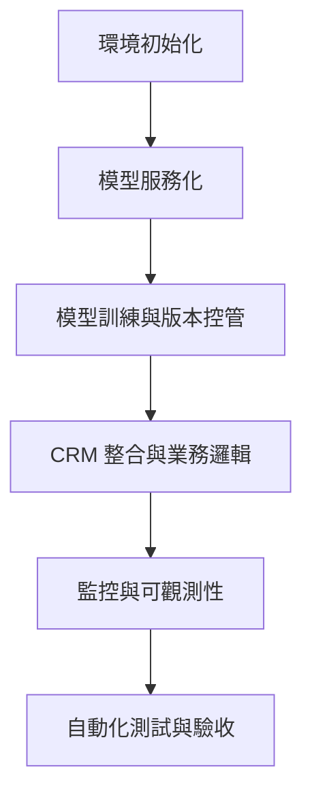

# 🚀 AI 模型整合與部署教學系統（MLOps Teaching System）

一套從「模型訓練」到「跨系統整合」、「監控驗收」的全流程 MLOps 教學平台。  
支援 FastAPI + MLflow + Prometheus + Grafana，讓你從零打造可觀測、可驗收的 AI 系統。

> 📦 適合對象：AI 工程師、資料科學家、技術講師、MLOps 初學者  
> 🧪 支援模組化驗收、Rubric 評量、CI/CD 自動測試  
> 🧰 支援 Windows / macOS / Linux，內建 Docker 化環境

---

## 🧭 模組導覽圖



---

## 🎯 模組任務與驗收標準

### M1｜環境初始化與依賴建構

- 📌 任務：建立 `.env`、安裝依賴、準備 Makefile
- ✅ 驗收：
  - `.env` 設定完成
  - `pip install -r requirements.txt` 成功
  - `make train` 可執行

---

### M2｜模型服務化與容器部署

- 📌 任務：設計 FastAPI 架構、撰寫 Dockerfile、整合 docker-compose
- ✅ 驗收：
  - `docker-compose up` 可啟動 FastAPI
  - `/predict` API 可回傳預測結果
  - `/health` 顯示模型載入狀態

---

### M3｜模型訓練與版本控管

- 📌 任務：使用 CLI 訓練模型、儲存至本地、註冊至 MLflow
- ✅ 驗收：
  - `app/models/sample_model.joblib` 存在
  - MLflow UI 中出現模型版本
  - `/health` 顯示 `model_loaded: true`

---

### M4｜CRM 整合與業務邏輯

- 📌 任務：查詢 CRM 特徵 → 預測 → 更新 CRM 分群
- ✅ 驗收：
  - `/crm_segment_update?customer_id=xxx` 回傳成功
  - CRM `segment` 欄位更新為預測結果
  - FastAPI 日誌顯示整合流程

---

### M5｜監控與可觀測性

- 📌 任務：設計 Prometheus 指標、建立 Grafana 儀表板
- ✅ 驗收：
  - `/metrics` 回傳指標文字
  - Prometheus 可查詢 `prediction_requests_total`
  - Grafana 顯示預測次數與延遲分佈

---

### M6｜自動化測試與驗收

- 📌 任務：撰寫 pytest 測試、設計 CI/CD 工作流
- ✅ 驗收：
  - `make test` 執行測試成功
  - `.github/workflows/ci.yml` 可自動建構並測試
  - 測試涵蓋 `/predict`、CRM 整合、指標暴露

---

## ⚙️ 快速啟動流程

```bash
git clone https://github.com/BpsEason/ai-mlops-system.git
cd ai-mlops-system
cp .env.example .env  # 設定 MODEL_VERSION

# 安裝依賴（Windows）
python -m pip install --upgrade pip
pip install -r requirements.txt

# 訓練模型並註冊（M3）
python mlops/train_model.py --n_samples 1000 --c_param 0.1 --model_version v1.2.0-stable

# 啟動所有服務（M2/M4/M5）
docker-compose up --build -d

# 驗證整合流程（M4）
curl -X POST "http://localhost:8000/crm_segment_update?customer_id=CUST_TEST_007"

# 執行測試（M6）
make test
```

---

## 📊 Grafana 儀表板建議（M5）

| 面板名稱 | 指標 | 說明 |
|----------|------|------|
| 預測次數 | `prediction_requests_total` | 每次呼叫 `/predict` 都會累加 |
| CRM 更新次數 | `crm_segment_updates_total` | 每次呼叫 `/crm_segment_update` 都會累加 |
| 預測延遲 | `prediction_latency_seconds` | 顯示預測延遲分布（直方圖） |
| 模型版本分布 | `model_version` label | 可視覺化不同版本的使用比例 |

---

## 🧪 Rubric 驗收與 Badge 評量（進階）

- `docs/rubric.yml`：定義每個模組的驗收項目與權重
- `docs/badges.yml`：對應完成度產生徽章（可用 shields.io）
- `scripts/eval_rubric.py`：讀取驗收結果，自動產生徽章

---

## 🧠 技術亮點

- FastAPI + MLflow + Prometheus + Grafana 全堆疊整合
- 支援 CLI 參數化訓練與模型版本控管
- 非同步 CRM 整合邏輯（httpx）
- Prometheus 指標設計符合 MLOps 可觀測性原則
- Dockerfile 使用非 root 使用者，強化容器安全性
- CI/CD 工作流支援 pytest 驗收與 Docker 建構
